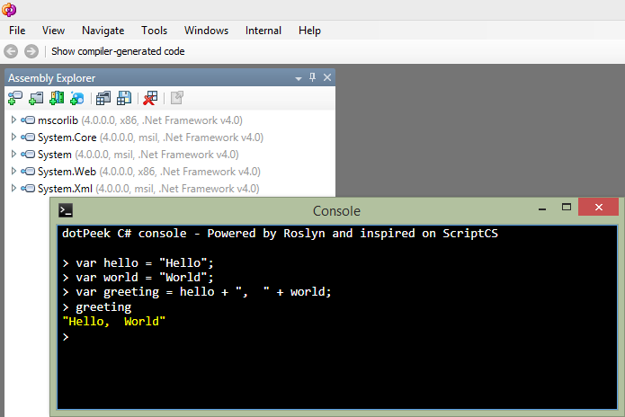

# dotpeek-console

dotPeek Console allows execution of C# code inside dotPeek.



## What does it do? ##

The plugin adds a new menu item under dotPeek's File menu:

+ Console

A context menu is also added for all assemblies:

+ Open Assembly in Console

Both menus will open up a console in which C# can be executed against assemblies.

## Working with the console ##

### Keyboard shortcuts ###

+ ```tab``` Naive autocompletion based on command history
+ ```up/down``` Browse through command history
+ ```shift+enter``` Newline without executing command

### Available commands ###

+ ```help``` Shows available commands
+ ```cls``` Clears the console
+ ```#r "assembly name or path"``` Reference an assembly for use in console

### Example code ###

When the dotPeek Console is opened, try runningthe following sample:

    class Person {
        public string Name { get; set; }
    }
    var me = new Person { Name = "Your name" };

Next, issue some commands like:

* ```me``` will display the Person instance
* ```me.Name``` will display the name property of the Person instance
* ```throw new Exception("Error here");``` will throw an Exception


## How do I get it? ##

If you wish to just install a copy of the plugins without building yourself:

- Download the latest zip file: [Console-1.0.zip](https://github.com/JetBrains/dotpeek-console/raw/downloads/downloads/Console-1.0.zip)
- Extract everything
- Run the appropriate batch file for your version of dotPeek, e.g. Install-Console.1.0.bat for dotPeek 1.0, or Install-Console.1.1.bat for dotPeek 1.1, or Install-Console.1.2.bat for dotPeek 1.2.

## Building ##

To build the source, you need the [ReSharper SDK](http://www.jetbrains.com/resharper/download/index.html) installed .

The build.bat file in this repository builds the plugin from scratch. Note that a folder _external_ containing subdirectories _v1.0_ and _v1.1_ must be created and dotPeek assembly files copied in to create the build.

If you only wish to target a specific version of dotPeek, open the appropriate solution file from the repository.

## Contributing ##

Feel free to [raise issues on GitHub](https://github.com/JetBrains/dotpeek-console/issues), or [fork the project](http://help.github.com/fork-a-repo/) and [send a pull request](http://help.github.com/send-pull-requests/).


